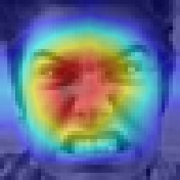
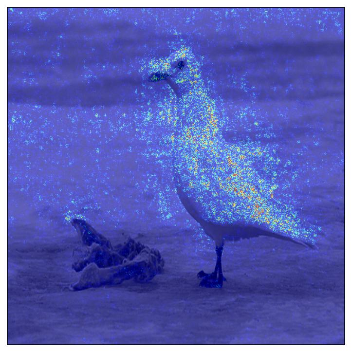
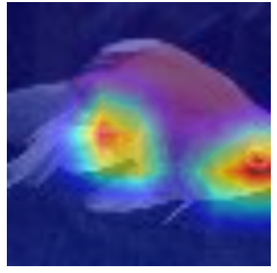
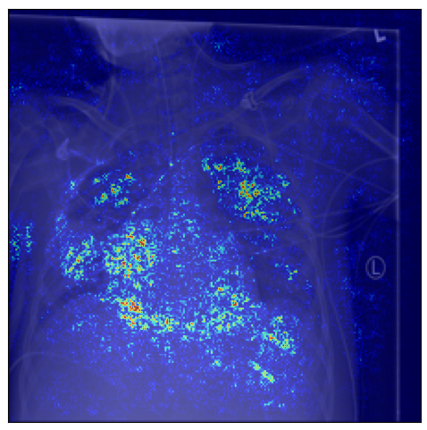

# Avaliação Comparativa de Métodos de Explicabilidade em Múltiplos Domínios de Reconhecimento Visual

Este projeto avalia diferentes métodos de Inteligência Artificial Explicável de maneira quantitativa e qualitativa. O objetivo é investigar o comportamento e desempenho dos
métodos em diversos domínios de conjunto de dados. O trabalho também explora o impacto da inserção de um módulo de atenção na arquitetura utilizada e propõe abordagens
híbridas realizando a fusão entre métodos.

## 👥 Autores
* **Gabriel Araujo Streicher** - UFSCar - Sorocaba, SP
* **Juan Pedro** - UFSCar - Sorocaba, SP
* **Pedro Andrade Dorighello** - UFSCar - Sorocaba, SP

## 🧠 Metodologia

O projeto utiliza uma rede neural convolucional **ResNet-50** pré-treinada no ImageNet. Foi avaliado também o impacto da implementação do módulo de atenção **CBAM** para enfatizar características importantes e suprimir as irrelevantes.

Foram comparadas abordagens baseadas em gradientes e livres de gradientes:
* **Grad-CAM**
* **Score-CAM**
* **RISE**
* **Integrated Gradients** 
* **Abordagens Híbridas**

Foram utilizados quatro conjuntos de dados distintos:

1.  **CUB-200-2011:** Classificação de nível fino de espécies de pássaros.
2.  **FER2013 (FER+):** Reconhecimento de expressões faciais.
3.  **NIH Chest X-Ray:** Detecção de anomalias em imagens médicas.
4.  **Tiny-ImageNet:** Classificação genérica de objetos.

As métricas de avaliação utilizadas foram:
* **Fidelidade:** Teste de deleção para medir a importância real das regiões destacadas.
* **Robustez:** Estabilidade da explicação frente a ruídos na imagem de entrada.
* **Esparsidade:** Medida pelo Índice Gini.
* **Coerência Espacial:** Agrupamento dos pixels de atenção.
* **Consistência Intra-Classe:** Similaridade das explicações para a mesma classe.

  
  
  
  
  

---
*Trabalho desenvolvido na Universidade Federal de São Carlos (UFSCar) na disciplina de Aprendizado Profundo para Reconhecimento Visual - Campus Sorocaba.*
